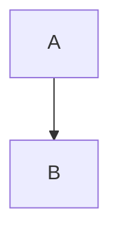
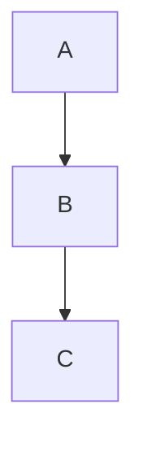

#important 
[[Java Programs]] for all the programs.
[[Java Differences]] for all differences
[[Extras]] for all the missing important that have been finished.

# Unit 1
## What is java?
- One of the most widely used programming language and software platform that was built to run on billions of devices.
- One of its major advantage is its portability IE.
	- once written, and compiled into byte code, it can be run on any devices as long as it has Java or JVM installed in it.
- Its rules and syntax is inspired from C and C++ and its primary goal is to be able to "Write once,  Run anywhere".

## History of Java
- Java was first bought into public in the 90's and was marked as an object oriented programming language.
- It was used to be used for the development of digital TVs. KCRs . toasters and many other electronics.
- It is one to the first platform independent programming language, IE programs written in Java are not tied to a particular computer system.

## Features of Java
- **Platform Independent:**
	- It is not compiled into a platform specific binary; rather is compiled into byte codes which are machine instructions for the JVM. This byte code is then interpreted by the JVM which interprets this code in to low level machine language.
 
- **Object-oriented:** 
	- Everything in java is an object.
	- It simplifies software development and maintenance by providing some rules.
	- Easily extended since it is based on the object model.

- **Multi-threaded:** 
	- It is possible to write programs that can perform several tasks simultaneously.
	- This feature allows a developer to construct interactive applications that can run smoothly without crashing or stuttering.

- **Robust**: 
	- It is eliminates error-prone situations by:
		- using strong memory management.
		- the lack of pointers that avoids security problems.
		- providing with automatic garbage collection which runs in the JVM to get rid of objects that are not being used by the application anymore.
		- proper implementations of exception handling and type checking mechanism.
		- emphasis more on compile time error checking.

- **Dynamic:**
	- It supports dynamic loading of classes. IE classes are loaded on demand.
	- Also supports classes from C and C++.
	- It supports dynamic compilation and automatic memory management (*garbage collection*).


## Java Virtual Machine (*JVM*)
- It is a runtime environment in which Java byte-code can be executed.
- It provides the following tasks:
	- Loads code
	- Verified code
	- Executes code
	- Provides runtime enviroment.
- It acts as a virtual processor which is why it is called Java Virtual Machine.


## Byte-Code
These are nothing but platform independent executable files that provides machine instructions for a Java Virtual Processor called the Java Virtual Machine, which then turns these instructions into machine code and helps execute these programs.

## Java Development Kit (*JDK*)
- A collection of tools that are used for development and execution of Java programs.
- These include:
	- Appletviewer
	- Javac (Java compiler)
	- Java (Java interpreter)
	- jdb (Java debugger)
	 and many more...

## Java Runtime Environment (*JRE*)
- It is a set of software tools that java programs require to run correctly.
- It is the underlying technology that communicates between the program and the operating system.
- It acts as a translator and facilitator, and provides all the resources so that once your write Java software, it runs on any operating system without further modification.

## Variable
- Container that holds the value while the Java program is executed.
- It is assigned with a data type
- There are three types of variable. These are:
	- **Local Variable:** These are variable that are defined within a block or method or constructor.
	- **Instance Variable:** These are variable that are declared inside a class but outside the body of the method.
	- **Static variable:** Variables that are declared as static.
```java
int data=50; // here data is variable
```

### How Variables are declared in Java?

```java
public class firstProg {
	int a=21; // Instance variable
	static int b = 24; // Static variable
	public static void main(String[] args) {
		firstProg obj=new firstProg();

		int a=29; // local variable

		Sytem.out.println(a);
		Sytem.out.println(obj.a);
		Sytem.out.println(b);
	}
}
```


## Constants
- Values that cannot be changed after assigning it.
- Java does not support constants directly.
- to declare any variable as constants, we use `static` and `final` modifiers.

##### Syntax

```java
static final datatype identifier_name = value;
```


## Java Keywords
- Also known as reserved words
- These are predefined words by Java which are used for some internal processes or represent some predefined actions.
- These words are not allowed to be used as variable names or objects.

### List of Java keywords
1. `abstract`
2. `boolean`
3. `break`
4. `case`
5. `catch`
6. `class`
7. `default`
8. `else`
9. `final`
10. `for`

## Why is Java called both compiled and interpreted language?
- Its source code is first compiled into a binary byte-code.
- This byte-code runs on the JVM, which is a software-based interpreter.

## Major C++ features that were intentionally removed from Java.
- It does not has any implementation of template classes as in C++
- It doesn't supports multiple inheritance
- It doesn't supports operator overloading.
- It doesn't supports global variables.
- Pointers are not used. ![[Pasted image 20230122213914.png]]
- No header files are required.

## Difference between C and Java

***The major difference between Java and C is that Java is a purely object-oriented language and has mechanism to define classes and objects.***

- Java doesn't include C unique statement keywords like `goto`, `sizeof`, and `typedef`.
- Java doesn't contain the user datatypes like --- `struct`, `union`, and `enum`.
- Java doesn't define the type modifier keywords like `auto`, `extern`, `register`, `signed`, `unsigned`.
- Java doesn't has a pre-processor and therefore cannot use `#define`, `#include` statements.
- Java doesn't support any mechanism for defining variable arguments to functions.


## Why is Java strongly associated with the internet?
- The first application program written in Java was called "Hot Java"
	- It was a web browser that ran applet on the internet.
- People used to use Java to create applet programs and ran them locally using a Java-enabled browser such as "Hot Java".
- "Hot Java" can also download an applet located on a remote computer which was connected to the internet.

*This is why Java is popularly known as Internet Language.*


## Various systems required for internet programming.
- Internet Connection
- Web-server
- HTML
- Applet tag
- Java code
- Byte-code
- Proxy server
- Mail server


## Java API
- Libraries of compiled code that can be used in a program.
- Java API consists of the functions and variables, that programmers are allowed access for their applications.

## Why is Java secure?
*Java also provides some features that make java more secure. These are:*
- Java programs are ran inside a virtual machine called the JVM which acts as sandbox.
- Java does not support explicit pointers instead uses implicit references.
- Byte-code verifier checks the code fragments for illegal code that can violate access rights to an object.
- It provides library level safety.
- Run-time security check takes place when we load new code. 
- Auto memory management (Garbage collection)
- Java uses compile-time error checking.
- Better implementation of Exception Handling.
- Java class libraries provide several API that leads to security. 
	- These APIs contain cryptographic algorithms and authentication protocols that lead to secure communication.

## Expressions
*A Java expression consists of variables, operators, literals, and method calls.*

Example:
```java
int score;
score = 90;
```

Here, `score = 90` is an expression that returns an integer.

Consider another example,
```java
Double a = 2.2, b = 3.4, result;
result = a + b - 3.4;
```

Here, `a + b - 3.4` is an expression.

#### Relational Expression
- Indicates the condition that a system evaluates.

Syntax:
```java
variable1 relation_operator variable2;
```

Example:
```java
var1 == var2
var1 > var2
```


#### Boolean Expression
- It is a Java expression that return a boolean value IE *True* or *False*.
- Used when comparing two or more values.

Example:
```java
int x = 10;
int y = 9;
System.out.println(x > y); //returns true
```


#### Logical Expression
- It is a type of boolean expression that uses logical operators like (`&&`, `||` and `!`) to combine multiple boolean expressions.
- These are often used in control flow statements, such as `if` and `while` to make decision based on the truth/falsehood of a statement.

Syntax:
```java
if(condition1 && condition2) {
	d = a + b + c;
}
```


## Control statements
***Java language posses decision-making capabilities and supports the following statements known as control/decision-making statement***

### `If` statement
- It is used to control the flow of execution of statement.
- It is a two way decision statement and is used in conjunction with the expression.

Syntex:
```java
if (text expression) {
	statement block;
}
statement x;
```


### `switch` statement
- Built-in multi-way decision statement
- It tests the value of a given variable against a list of cause values
- When a match is found, a block of statement associated with that case is executed.

Syntax:
```java
switch (expression) {
	case value_1:
		block_1;
		break;
	case value_2:
		block_2;
		break;
	......
	.......
	default:
		default_block;
		break;
}
statement x;
```

### Conditional operator statements
- It is a quick way of writing `if-else` statements
- Useful for making two way decisions.
- This operator is a combination of `?` and `:` and takes three operands.

Syntax:
```java
condition ? expression1 : expression2;
```

Here,
- If `condition` is true; the entire expression evaluates to `expression1` .
- If `condition` is false; the entire expression evaluates to `expression2` .

It can also be used to assign values to a variable based on a condition.
```java
int x = (condition) ? value1 : value2;
```

This can be read as "*If condition is true, assign `value1` to x, else assign `value2` to x.*"


## Looping in Java
***Used to repeatedly execute a block of code until some condition(s) for the termination of the loop is/are satisfied or while a certain condition is true.***

### `while` loop

It is used to repeatedly execute a block of code as long as the condition it is tested on is true.

Syntax:
```java
while (condition) {
    // code to be executed
}
```

### `do-while` loop

Similar to while loop but is an exit-control loop IE the block of code is executed at lest once before the condition is checked.

Syntax:
```java
do {
    // code to be executed
} while (condition);
```

### `for` loop

It is used to repeatedly execute a block of code a certain number of times, or while a certain condition is true just like a while loop but has more concise loop control.

Syntax:
```java
for (initialization; condition; increment) {
    // code to be executed
}
```


## Array
- It is a container object that holds a fixed number of values of same data-type.
- These values can be of any type, some common types are:
	- Integers
	- Strings
	- Objects
- Useful for storing and manipulating large amounts of data.
- In Java arrays are created using the `new` operator, followed by the data-type and the size in square brackets.

Syntax:
```java
int[] numbers = new int[size];
```

### [[Single dimensional arrays]]
Referred to a linear array.

Syntax:
```java
data_type array_name[] = new data_type[size];
```

[[Java Programs#Single Dimensional Array]]

### [[Two dimensional arrays]]
These are matrices, also called double indexed variables.

Syntax:
```java
data_type array_name[][] = new data_type[row][column];
```

[[Java Programs#Two Dimensional Array]]

## Java Tokens
Smallest element of a program that is meaningful to the java compiler.

### Tokens can be classified as follows
- [[Keywords]]
- [[Identifiers]]
- [[Constants]]
- Special Symbols
- [[Operators]]

# Unit 2
## [[Class in Java]]
![[Pasted image 20230119234430.png]]
- Fundamental building blocks of object-oriented programming language.
- A collection of objects
- Can also be defined as *template that describes the data and behavior associated with the class instantiation.*

### *Following are the different types of classes in java:*
#### Predefined classes
As the name implies, these are pre-defined classes provided by java for the developers, each of these classes serve a specific purpose. 

Some examples:
- [[Scanner]] \****
- Console
- System 
- String

#### User-defined classes
Classes created by the programmer(s), are called user-defined classes.

## Objects
***Java is an OOP language, and almost everything in Java acts as an object, including primitive data-types(int, double, etc) which are internally wrapped in objects of their corresponding wrapper classes(Integer, Double, etc.)***.

- These are an instance of a class.
- Objects have two main characteristics:
	- **State:**
		- It is represented by the values of its properties or fields.
		- These values can change during the lifetime of an object.
	- **Behavior:** 
		- It is represented by the methods or functions the class can perform.
		- Methods define the actions that an object can take.
- To create an object in Java, we use the keyword `new` and call the constructor of the class.
	- The constructor is a special method that is automatically called when an object is created and it allows us to set the initial state of the object.


## Polymorphism
**It basically means that** *'the same object has different behavior'.*


### Compile-time polymorphism
Polymorphism that exist at the time of compilation is called compile-time polymorphism, also known as *static polymorphism*.

#### Method-overloading
*also called ad-hoc polymorphism*
- It is the ability of defining multiple methods with the same name in a class
- When the method is invoked, the compiler picks the correct one based on the arguments passed to the method.
	- This implies that overloaded methods must have different numbers or types of arguments.
 
[[Java Programs#Method Overloading]]

### Runtime polymorphism
Polymorphism which exists at the time of execution is called runtime polymorphism.

#### Method-overriding 
***Creating a method in a subclass that has the same name, number and types of arguments, as a method in a super-class. That new method then hides the super-class's method.***

[[Java Programs#Method Override]]

## Constructors
***A constructor is a special method with the same name as its class and no return type. It is called when a new class instance is created, which gives the class an opportunity to set up the object for use.*** 
 [[Java Programs#Constructor]]

*Constructors like other methods, can accept arguments and can be overloaded(they are not, however, inherited like other methods.)*

### Constructor overloading
***It can be defined as the concept of having more than one constructor with the same name but with different parameters so that every constructor can perform different tasks.***

[[Java Programs#Constructor Overloading]]

## Inheritance
- Creating new classes based on existing ones.
- Class that inherits from another class can reuse the methods and fields of that class.
- We can add new fields and methods to our current class as well.

### Types of inheritance
#### Single-level inheritance
In these, all the sub-classes  inherit the features of one superclass.


[[Java Programs#Single level Inheritance]]


#### Multi-level inheritance
***This is basically multiple single-level inheritance stacked on top of one another. Here a derived class will be inheriting a base class. But unlike single-level inheritance, this derived class can also act like a base class for other classes. In Java, a class cannot directly access the grandparent's members.***



[[Java Programs#Multi-level Inheritance]]

## Package
- Way of grouping together related classes and interfaces.
- It enable modular groups of classes to be available only if they are needed.
- These eliminate potential conflicts between class names in different groups of classes.

#### Following are the different types of packages
##### Pre-defined
These are pre existing packages that are part of the Java Development Tools provided by the Java Development Kit.

Some of the most used pre-defined packages are as follows:
- java.lang
- java.util
- java.io
- java.awt
- java.applet
- java.net
- java.SQL

##### User-defined
These are packages that are created by the programmer and are used to store code that are repeatedly used in multiple programs. User-defined packages are created with the help of `package` keyword. To use these packages, we need to use the `import` keyword.

Advantages of user-defined packages:
- Reuseability
- Security
- Fast Searching
- Mitigate Naming Conflict
- Efficiency.

## Garbage-collection
- Garbage means un-referenced objects.
- It is the process of reclaiming the runtime unused memory automatically.
- In other words, ***IT IS A WAY TO DESTROY THE UNUSED OBJECTS***.

Garbage collector of JVM collects only those objects that are created with the help of the `new` keyword. If we have to create any object without the `new` keyword, we have to use the `finalize` method to perform the cleanup process(*destroying remaining objects*).

## `finalize` method
It is called by the JVM when an object is no longer being used(*i.e., when there are no further references for it*) but before the object's memory is actually reclaimed by the system.


# Unit 3
## Exception Handling
It is a mechanism to handle runtime errors, so that normal flow of the program can be maintained.

### Advantages
- Using exception handling, we can separate the error handling code from normal code.
- Using exception handling, we can differentiate between the error types.
- Normal flow of the program can be maintained.


### Types of exceptions 
#### Checked exception
- Exceptions that are checked at the compiled time.
- It forces us to use `try-catch` or `throws` statements.
- All exceptions except `Error`, `RuntimeException` and their subclasses are checked exceptions.
- *Example:* `IOException`, `SQLException`, *etc.*

#### Unchecked exception
- These are not checked at compile time
- These are checked at runtime of the program.
- These does not force you to use `try-catch`, `throws` statements.
- `RuntimeException` and all its subclasses are example of unchecked exceptions.
- Occurs due to bad programming practices.

[[Java Programs#Exception Handling]]


## Multi-threading
- Process of executing multiple tasks simultaneously
- provides concurrent execution of two or more parts of a program to make maximum use of CPU time.
- A multi-threaded program contains multiple parts that can run concurrently.
- Enables programmers to write better and efficient codes without compromising quality and performance.

### How to create threads in Java?
- Threads are implemented in the form of objects that contains a method called `run()` method.
- The `run()` method is the heart and soul of a thread.
- It makes up the entire body of the thread and is the only method in which the threads behaviour can be implemented.

*Typical `run()` method can be written as follows:*

```java 
public void run() {
	// Statement for implementing thread.
}
```

[[Java Programs#Multithreading]]

### Life cycle of a thread.
- Newborn/New Thread state
- Runnable state
- Running state
- Block state
- Dead state

## Autoboxing
It is the automatic conversion that the Java compiler makes between the primitive datatypes(*int, float, double, boolean, etc.*) and their corresponding object wrapper classes(*Integer, Float, Double, Boolean, etc.*).

```java
class BoxingExample {
	public static void main(String[] args) {
		int a = 50;
		Integer a2 = new Integer(a); // Boxing
		Integer a3 = 5; // Boxing
		System.out.println(a2 + " " + a3);
	}
}
```

## Unboxing
It is the automatic conversion that the Java Compiler makes between the object wrapper class(*Integer, Float, Double, Boolean, etc.*) and their corresponding primitive datatypes.

```java
class UnboxingExample {
	public static void main(String[] args) {
		Integer i = new Integer(50);
		int a = i;
		System.out.println(a);
	}
}
```


## Abstract class
Abstract classes are classes declared with `abstract`. They can be subclassed or extended, but cannot be instantiated. You can think of them as a class version of interfaces, or as an interface with actual code attached to the methods.

## Interface
*An interface is a collection of method names, without actual definitions, that indicates that a class has a set of behaviors in addition to the behaviors the class gets from its superclasses.*


We can use the keyword `implements`  to create an interface in Java.

- Interface are public and abstract by default.
- Interface variables are by default `public + static + final`.
- Interface method must be overridden inside the implementing classes.

[[Java Programs#Interface]]

# Unit 4
## Applet life cycle
- Special programs that are embedded in web pages to generate dynamic contents.
- It is a class in Java.
- Its life cycle can be defined as the process of how the object is created, started, stopped, and destroyed during the entire execution of the application.
- Basically has five core methods
	- `int()`
	- `start()`
	- `stop()`
	- `paint()`
	- `destroy()`
- These methods are invokes by the browser.

![[Pasted image 20230122153545.png]]

1. `int()` 
	1. First method to run the initialization.
	2. Can be invoked only once at the time of initialization
	3. Web browser creates the initialized object, ie the browser after checking security setting runs the the `init()` method within the applet.
 
 2. `start()`
	 1. Contains the actual code of the applet and starts the applet.
	 2. invokes immediately after `init()`
	 3. Each time browser loads, refreshes, maximized, restored, the `start()` method is invoked.
	 4. Inactive until `init()` is invoked.
 
 3. `stop()`
	 1. stops the execution of the applet.
	 2. invoked whenever the applet is minimized, stopped or moving from one browser tab to another.
	 3. when we go back, the `start()` method is invoked to resume the operation.

 4. `paint()`
	 1. belongs to the Graphics class in Java.
	 2. Used to draw shapes
	 3. Executes after the `start()` method and when the browser/applet in resized.
 5. `destroy()`
	 1. destroys the applet after its work is done.
	 2. invoked when applet window is closed or when the tab containing the web page is closed.
	 3. removes applet from memory 
	 4. executed only once.
	 5. unable to start applet once it is destroyed.

# *AWT == Abstract Windowing Toolkit*

## Difference between AWT and Swing
| Swing | AWT |
|---|---|
| Platform independent |  Not Platform Indepent|
| Lightweight | Heavyweight |
| Support pluggable look and feel | Does not support pluggable look and feel |
| Provides more no. of component class | Less no of components |
| Follows MVC | Does not follow MVC |

## Layout Manager
- Used to arrange components in a particular manner
- facilitates use to control the positioning and size of the components in GUI forms
- It is an interface that is implemented by all the classes of layout managers. 
- Layout managers are represented by the following layout:
	- `java.awt.BorderLayout`
	- `java.awt.FlowLayout`
	- `java.awt.GridLayout`
	- `java.awt.CardLayout`
	- `java.awt.GridBagLayout`
	- `java.awt.BoxLayout`

## Container in Java
- interface between a component and the low-level, platform-specific functionality that supports the components.
- can be described as:
	- a special component that can hold the gathering of the components
- types of container:
	- top-level containers
		- these are the heavyweight containers such as JFrame, JApplet, JWindow, etc.
	- low-level containers
		- these are lightweight containers such as JPanel.
- Most commonly used containers are JFrame, JPanel, and JWindow
- Important methods of the container class are `add()`, `invalidate()`, `validate()`.


# Unit 5

## JDBC(*Java DataBase Connectivity*)
- standard Java API for interacting to an SQL database.
	- helps
		- connect to databases
		- create databases
		- execute queries
		- viewing and modifying the resulting record.
- introduced in Java 1.1
- application programming interface
- defines how a client may access a database
- java based data access technology used for java database connectivity.
- part of the java standard edition platform, from oracle.


### Application of JDBC
- it is a specification that provides a complete set of interfaces that allows for portable access to an underlying database.
- Java can be used to write different types of executables such as 
	- application - applets - servlete - JSP - EJBS 
	- these different executable are able to use a JDBC driver to access a database and take advantages of the stored data.

### Architecture of JDBC
- JDBC API supports both two-tier and three-tier processing models for database access
- but in general JDBC contains two layer
	- JDBC API
		- provides the application to JDBC manager connection
	- JDBC Driver API
		- supports the `jdbc manager --- driver` connection.
- JDBC API uses a driver manager and database specific drivers to provide transparent connectivity to heterogeneous database.
- it ensures that the correct driver is used to access each data source
- It is capable of supporting multiple concurrent devices connected to multiple heterogeneous datase.

#### Diagrammatic representation
![[Pasted image 20230124023019.png]]

### Different components of JDBC
There are generally four main components of JDBC through which it can interact with a database. They are as mentioned below:
1. **Driver Manager:**
	1. class that contains a list of all drivers.
	2. when a connection request is received, it matches the request with the appropriate database driver using a protocol called *communication sub-protocol.*
	3. The driver from its list of drivers that matches to the requested driver, is used to establish a connection
2. **Driver:** 
	1. an interface which controls the communication with the database server.
	2. DriverManager objects are used to perform communication.
3. **Connection:** an interface which contains methods to contact a database,
4. **Statement:** interface that creates an object to submit SQL queries or statement the database.
5. **ResultSet:** contains results retrieved after the execution of the SQL queries.
6. **SQLException:** Any errors that occur in database application are handled by this class.


## How database connections can be established through JDBC.

To connect a java program to a database via JDBC, we must follow the procedure given below:

##### **Step 1:** *Import the package*
Here, we import the `java.sql` package, which can be written as
```java
import java.sql.*;
```

##### **Step 2:** *Registering or loading the drivers*
- we use the `forName()` method to register the driver class.
- here, we load the drivers class file into memory at runtime.
- No need of using `new` or create objects.

*Following example uses* `Class.forName()` *to load the Oracle driver.*
```java
Class.forName("oracle.jdbc.driver.OracleDriver")
```

##### **Step 3:** *Establishing a connection using the connection class object*
After loading the driver, establish connections as shown below:
```java
Connection con = DriverManager.getConnection(url, user, password);
```

Here, 
- `user`: Username from which your SQL command prompt could be accessed.
- `password`: used to authenticate the connection.
- `con`: Reference to the connection interface
- `url`: Uniform Resource Locator which is created as shown below:
```java
String url = "jdbc:oracle:thin:@localhost:1521:xe"
```

Where,
1. `oracle` is the database used
2. `thin` is the driver used
3. `@localhost` is the IP where the database is located.
4. `1521` is the port number
5. `xe` is the service provider.

##### **Step 4:** *Create a statement*
- once connection is established, you can interact with the databse.
- The `JDBCStatement`, `CallableStatement` and `PrepareStatement` interface defines the methods that enable you to send SQL commands and receive data from your database.
Use of JDBC is as follow:
```java
Statement st = con.CreateStatement();
```

##### **Step 5:** *Execute the query*
- most important part IE
	- executing our queries,
- Query here is the SQL query
- We can perfrom
	- insertion
	- deletion
	- update
	- search
	 *and many others...*
- `executeQuery()` method of the Statement interface is used to execute queries
- this method return object of ResultSet that can be used to get the records of a table.

##### **Step 6:** *Closing the connection*
After finishing all the operations we can use `close()` to close the connection

*Syntax*
```java
con.close();
```
